.. _player_root:

Player
------

Each player instance can be independently configured, played, and recorded from using the following controls.

.. _player_config:

Player configuration
********************

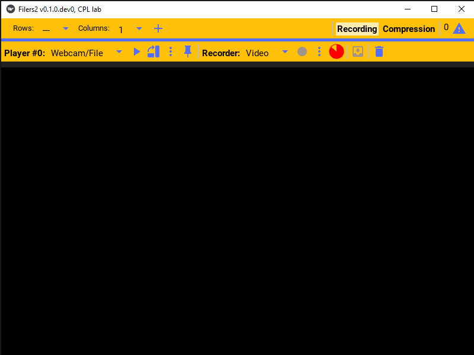

For a given player, one must first select the type of camera that will be used by the player. In the player bar click the camera type dropdown menu.

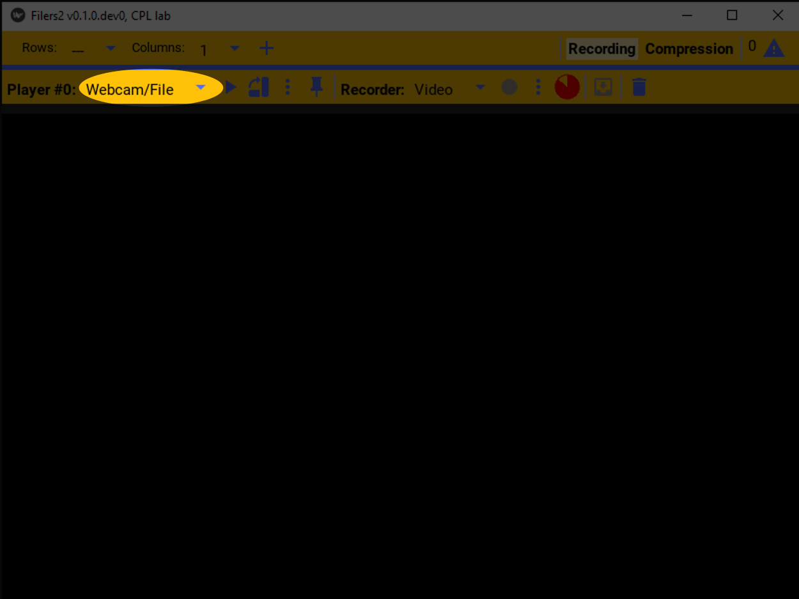

This will list the available camera types. This example will use a WebCam!

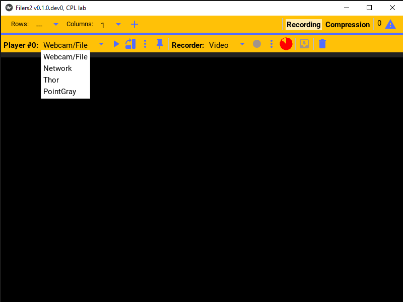

To configure the selected player, click the settings button. That will open the selected player’s settings.

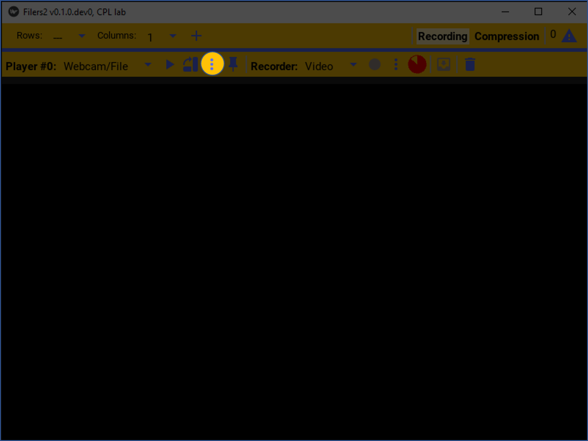

This specific player, supports either playing from a WebCam or replaying a video file. We'll select the WebCam option.

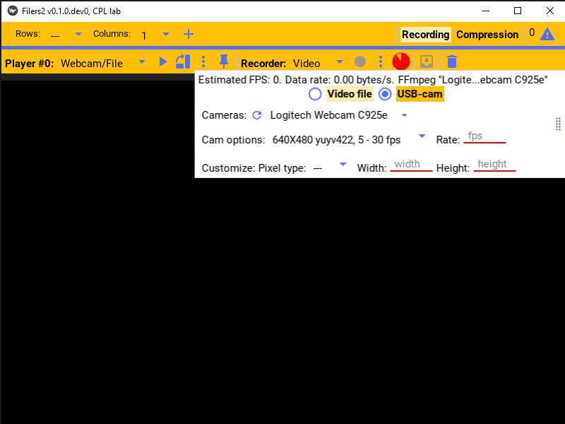

The player's settings can also be pinned to the window.

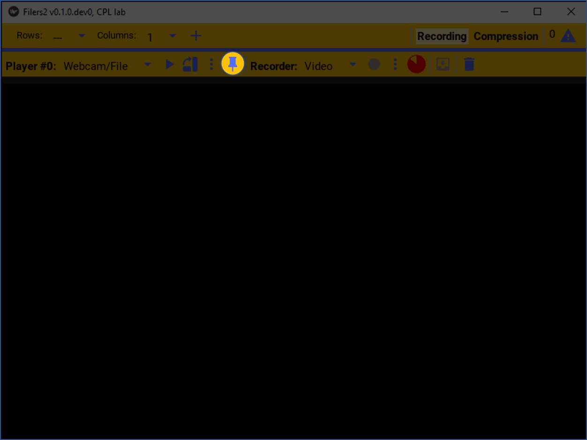

This will make it easier to configure and preview the camera.

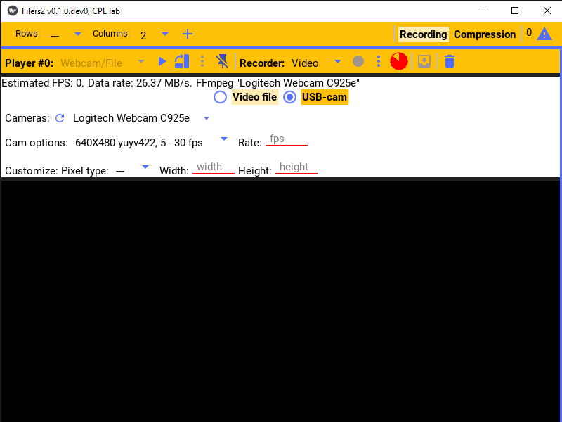

Player control
**************

Once configured, to start playing and previewing images from the camera, just press the play button.

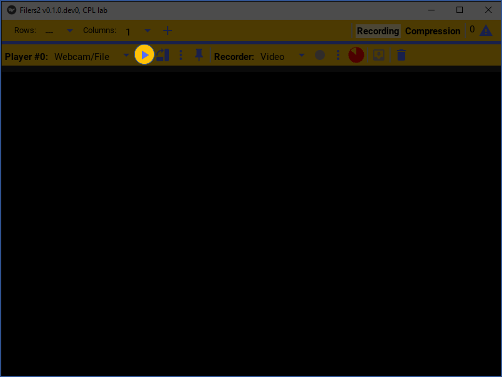

Camera images will now be streamed and displayed on the preview screen.

.. raw:: html

    <iframe width="560" height="315" src="https://www.youtube-nocookie.com/embed/f2LDUvpm3Is" frameborder="0" allow="accelerometer; autoplay; encrypted-media; gyroscope; picture-in-picture" allowfullscreen></iframe>

If the picture needs to be re-oriented such as when the video camera is rotated, press the rotate button to visually rotate the picture in ninety degrees increments.

This will only rotate the image on the preview screen, but does not rotate the recorded video images, however.

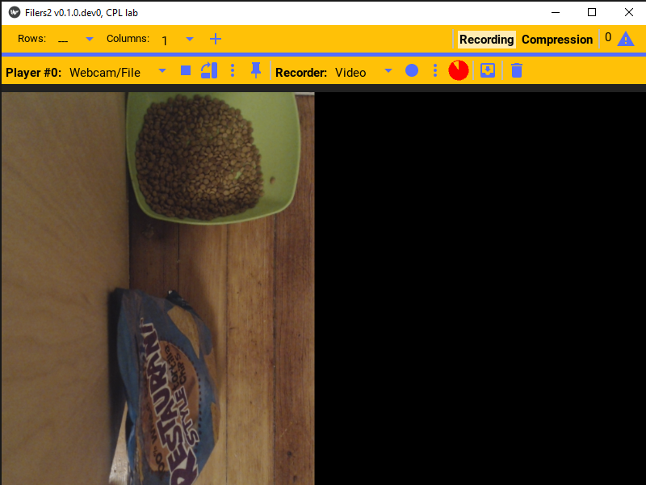

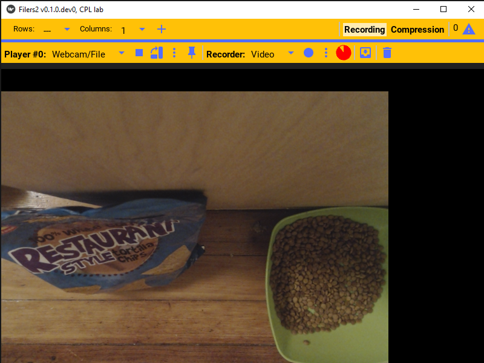

When you're done with playing the camera's video, press the stop button to stop and close the camera.

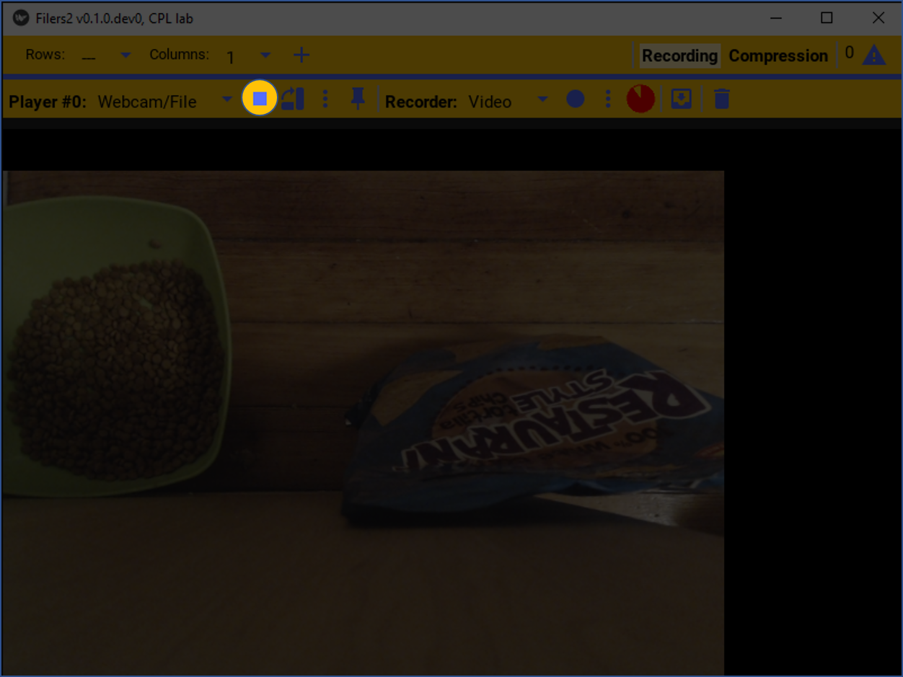

The last camera image will remain on screen.

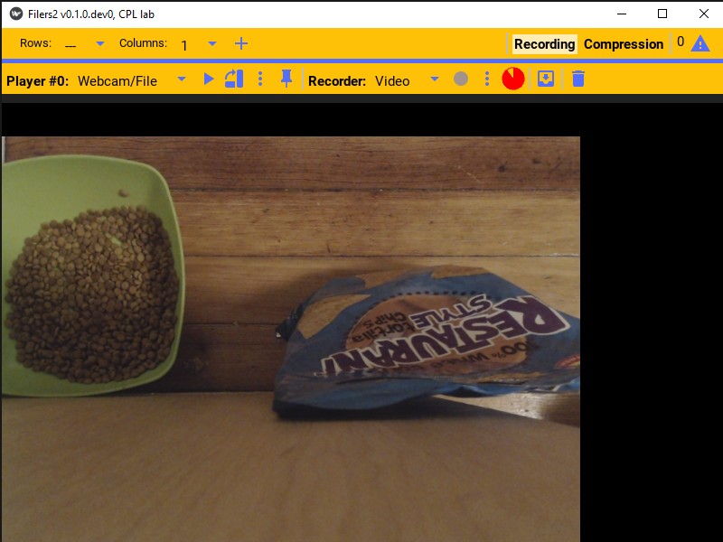
