Player Sources
--------------

Filers2 supports multiple camera types and media sources. Examples are webcams, webstreams, PointGray cameras or Thor cameras.

Following is an overview of each of them. Each source can be selected in the player dropdown menu.

WebCam or Video file/stream
***************************

WebCam
^^^^^^

Filers supports playing many USB WebCams. To use it, select the "USB-cam" option in the settings.

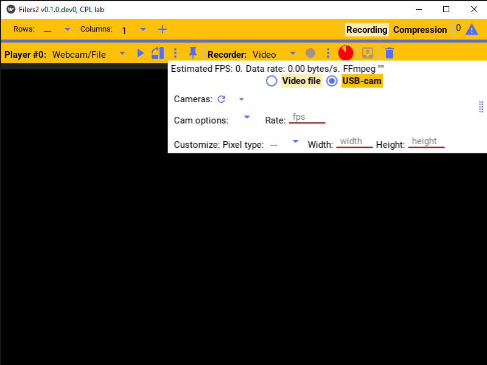

Click the refresh button to refresh the list of available webcams.

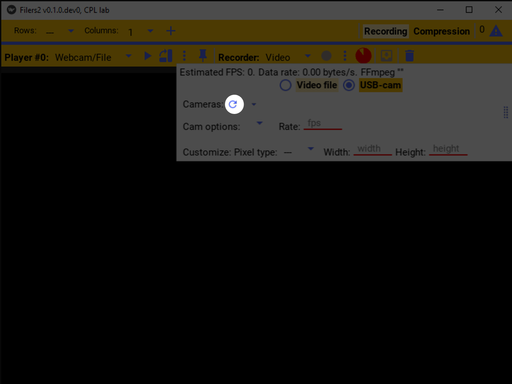

The first webcam should be automatically selected.

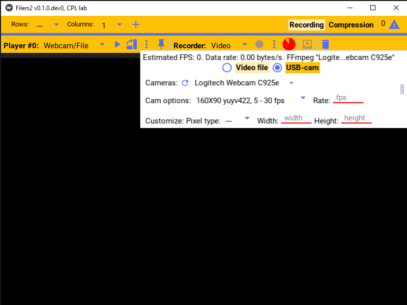

Select your webcam from the dropdown list of cameras

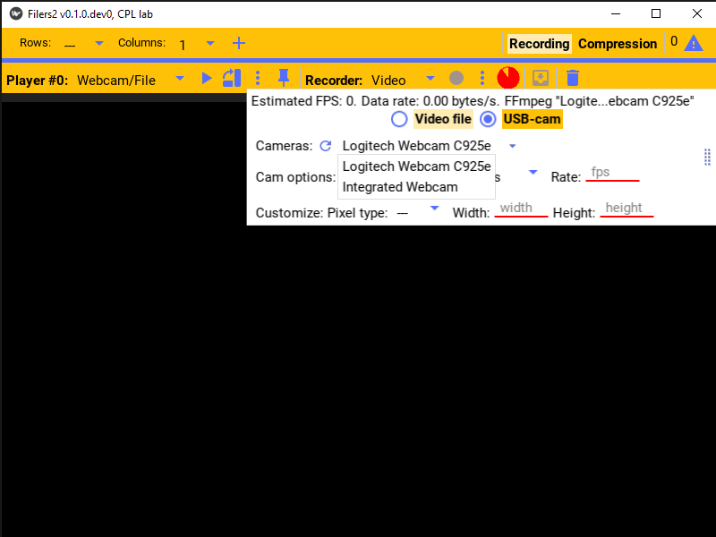

Camera options
""""""""""""""

Each camera supports different image sizes and frame rates.

Click the cam options to show the list of supported image formats.

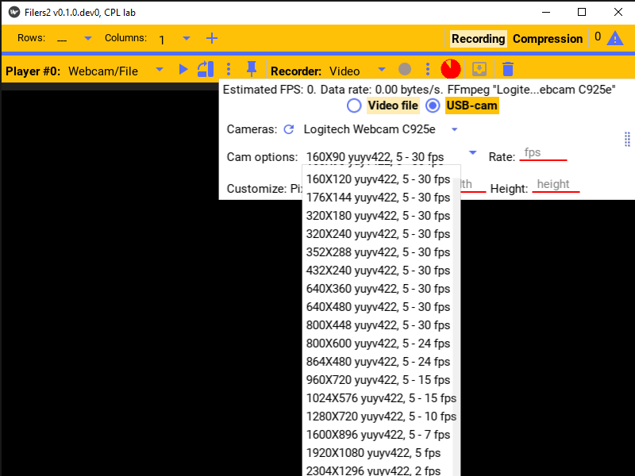

The typical structure is of each item is: the picture size in width x height, the pixel format of the image, and the supported frame rate range.

Typical pixel formats are `rgb <https://en.wikipedia.org/wiki/RGB_color_model>`_ or
`yuv <https://en.wikipedia.org/wiki/YUV>`_. RGB tends to use more space to represent the image, so yuv is often preferred when space is limited or writing to disk is a bottleneck.

640x480 is a good default frame size.

.. image:: ../images/guide/usb_player_640.png

The frame-rate (fps), the pixel format, and width and height of the image can be manually selected by editing the corresponding fields in the settings. If left blank, the default value or the value from the dropdown will be used.

Once the camera is playing, a estimate of the frame rate and the data rate (space required to save the raw images for each second) is shown at the top of the settings. Examples of different frame sizes are shown below. Notice that at very large frames sizes, the frame rate is significantly reduced in order for the camera to maintain a similar data rate.

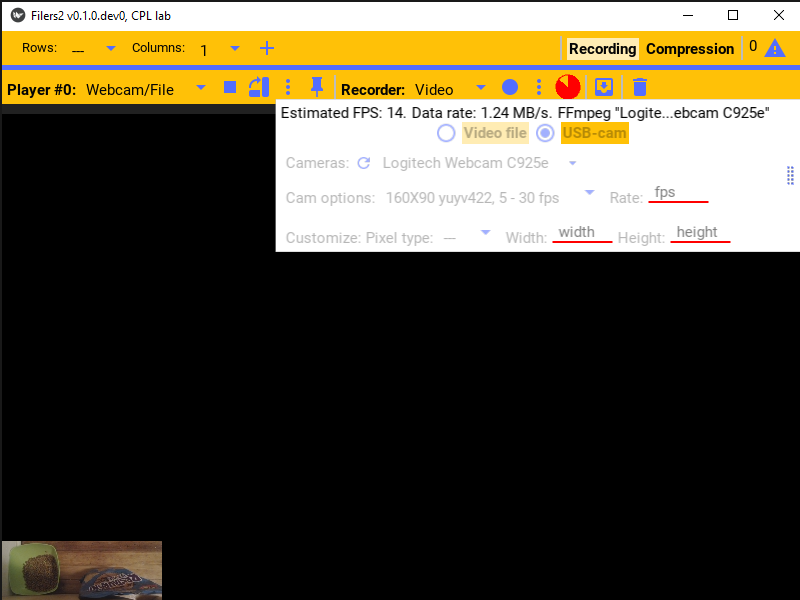

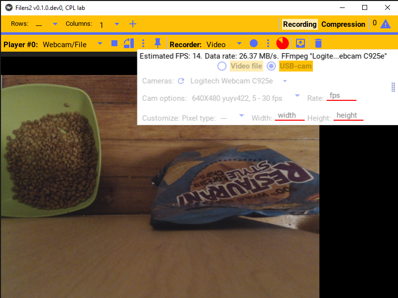

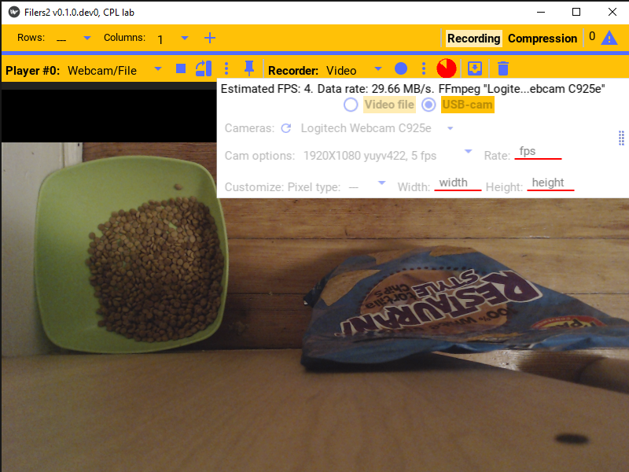

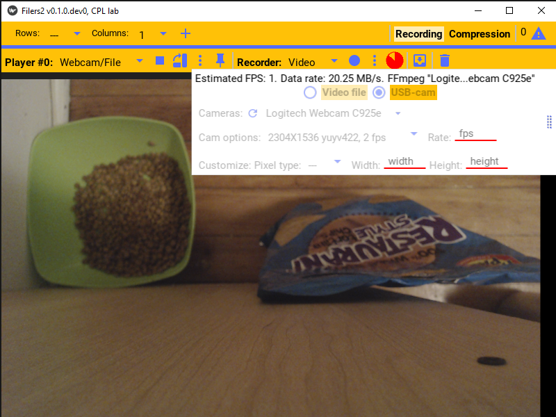

Video file/stream
^^^^^^^^^^^^^^^^^

The player also supported playing from a video file, webstream, or other non-typical sources.

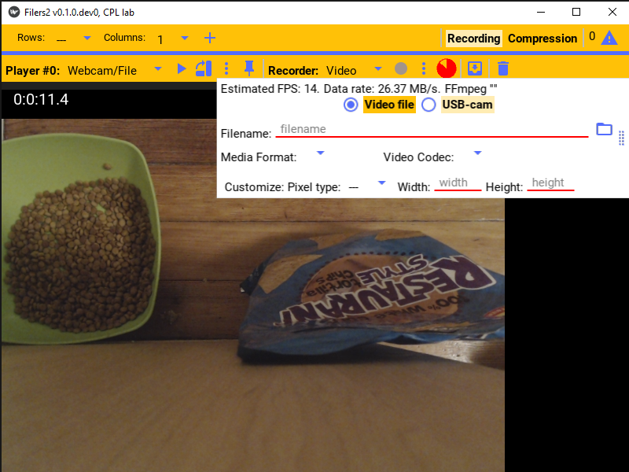

For example a file can be selected using the browse button or typed into the filename field and the file will be played.

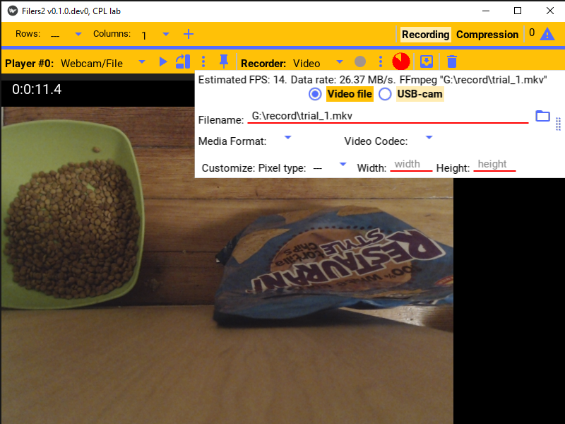

The other options are useful when playing other sources, e.g. a webstream.

For example to play the webstream at ``rtsp://wowzaec2demo.streamlock.net/vod/mp4:BigBuckBunny_115k.mov``,
use that as the filename and select ``rtsp`` as the ``Media Format``.

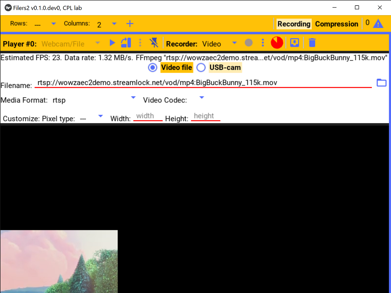

The other options can be similarly specified as needed.

Network
*******

The network player allows you to play video from another Filers2 instance that is streaming it video to the network.
This player is able to play that stream.

E.g. consider a computer that is connected to the camera, but is unable to store the video. A good option is to then stream the video to another computer over the network, and the other computer will save it as needed. The configuration is then to make the camera connected computer be a "network recorder" and select "Network" as the player source in the other computer.

Before it can be played, the appropriate network address of the streaming computer and the port it's streaming on must be specified. Then, once "open connection" is pressed and the connection succeeded, the player is ready to play.

See the recording documentation for more details.

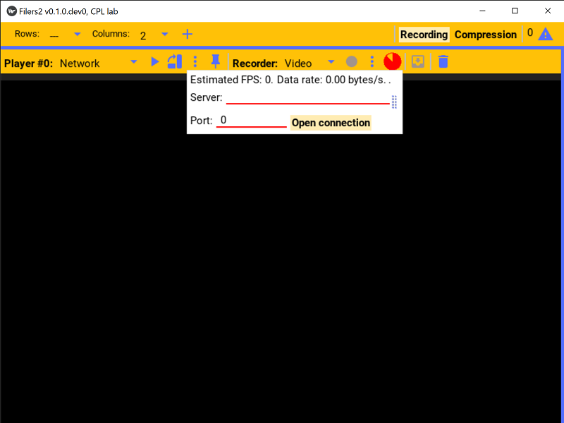

Thor
****

PointGray
*********

