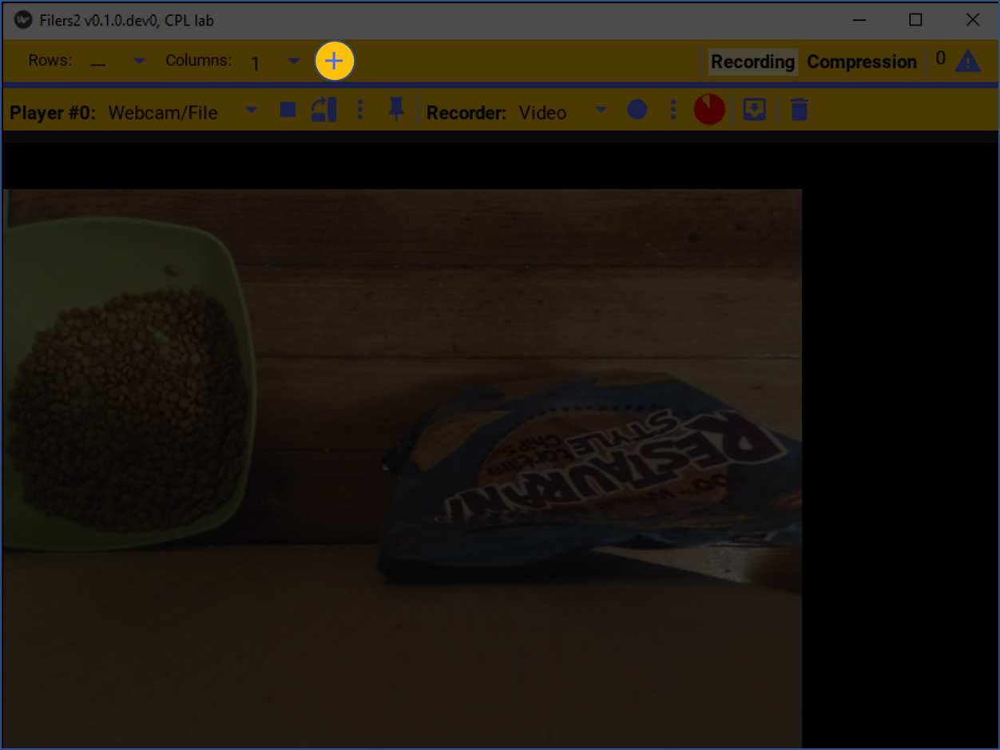
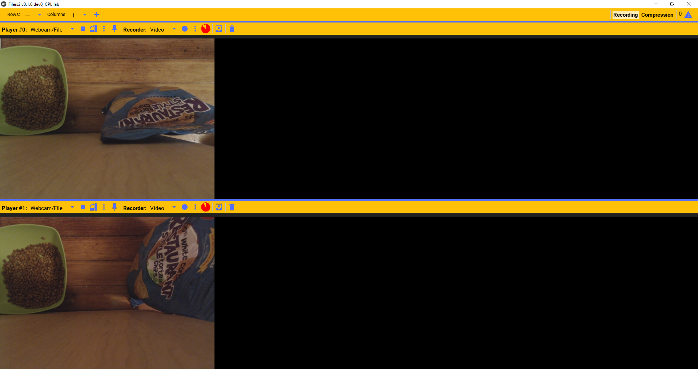
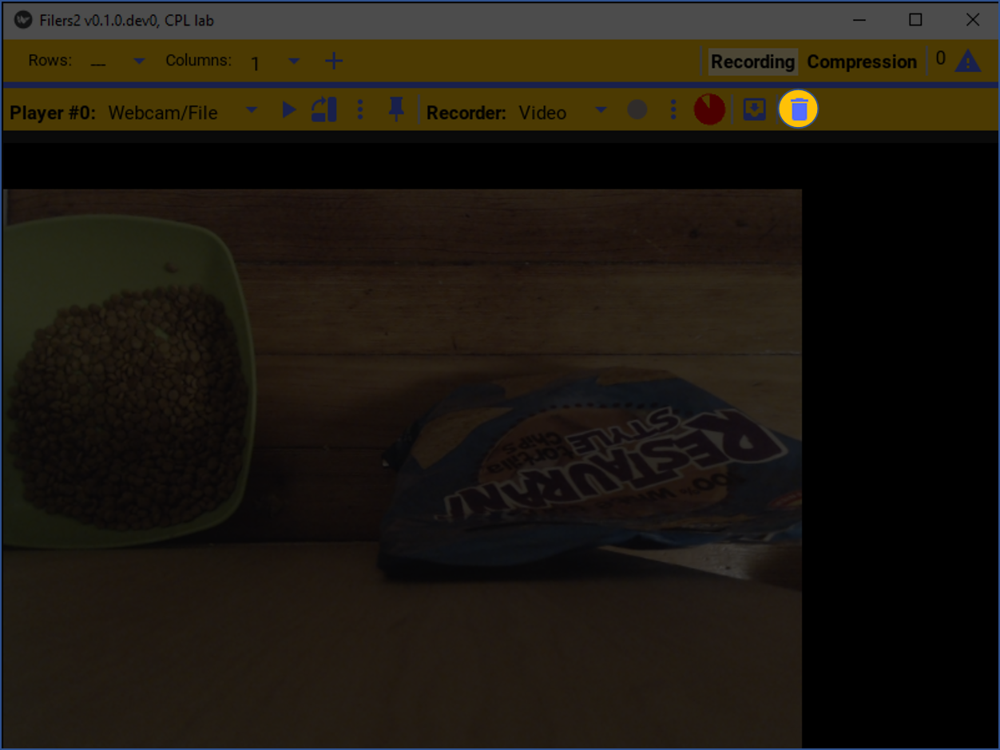
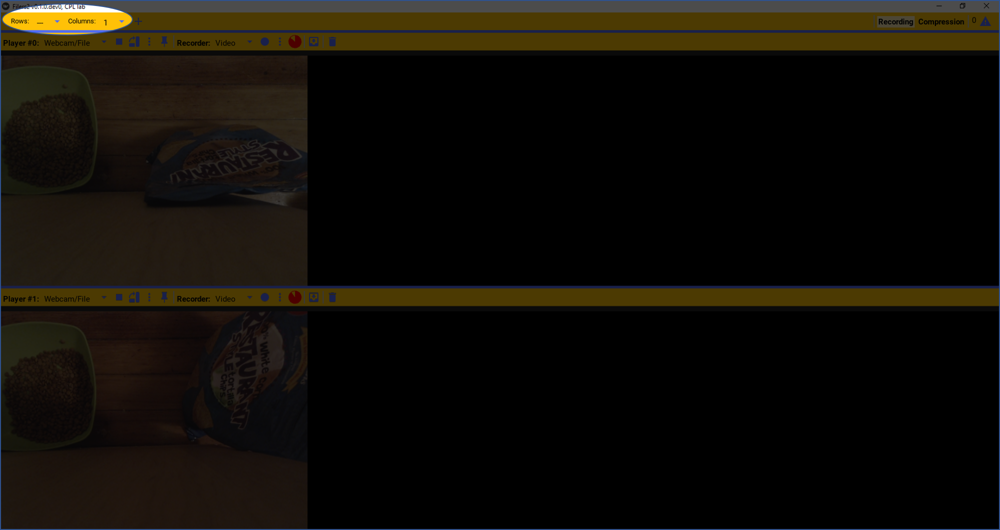
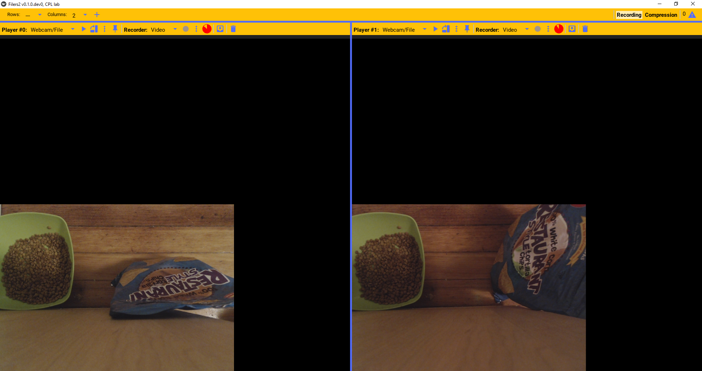
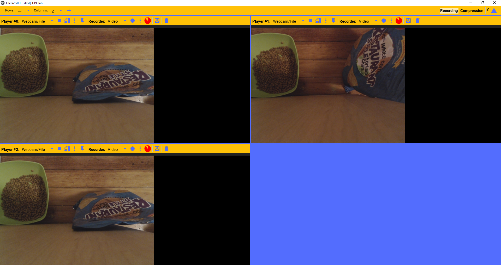
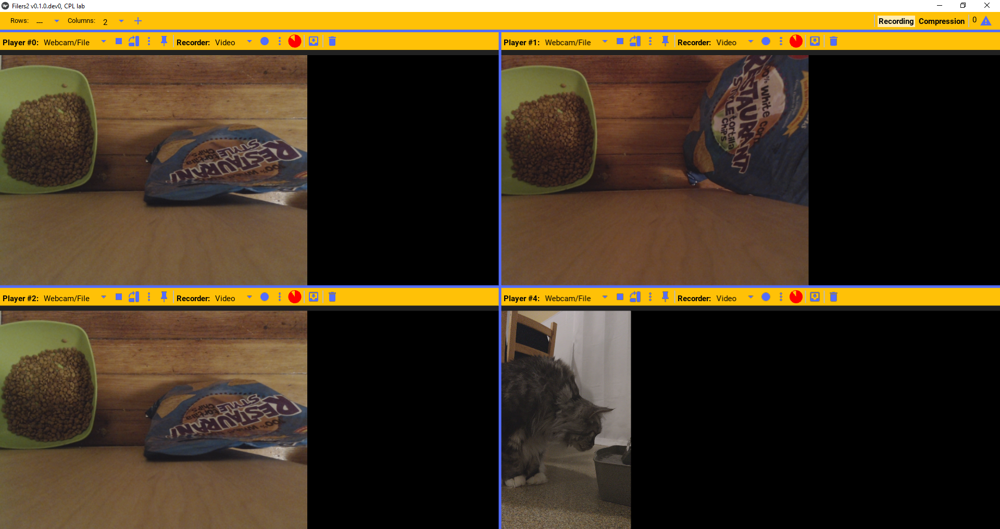
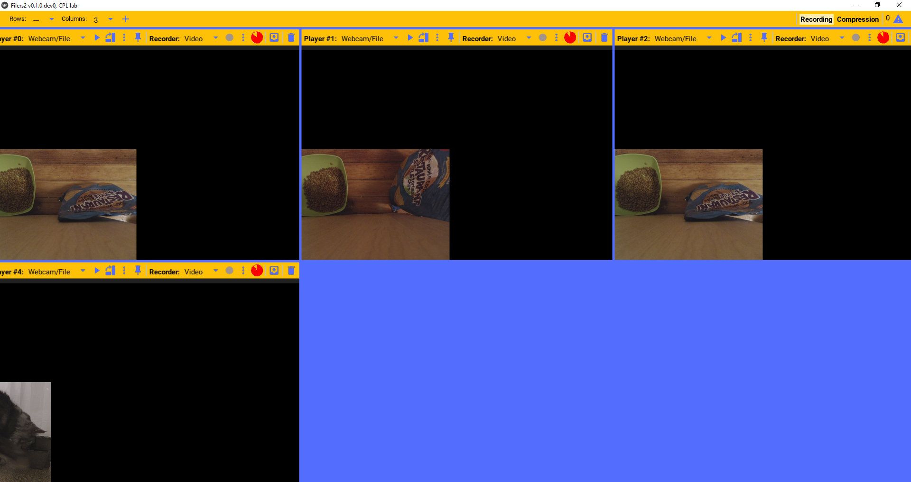

Managing players
----------------

Adding/removing players
***********************

More than one video player can be playing at any time. To add a new player, press the add player button.

This will add a new independent player on screen.

If a player is not needed anymore, it can be deleted from the grid by pressing the trash button. This will delete the camera.

Players layout
**************

The arrangements of the players in the grid can be changed, by changing the grid parameters.

For example it can be set to two columns with as many rows as needed. E.g. if there are 10 players, it'll be displayed as 5 rows and 2 columns.

We can add as many players as needed.

Other grid arrangements is also supported; such as n x 3 columns.

