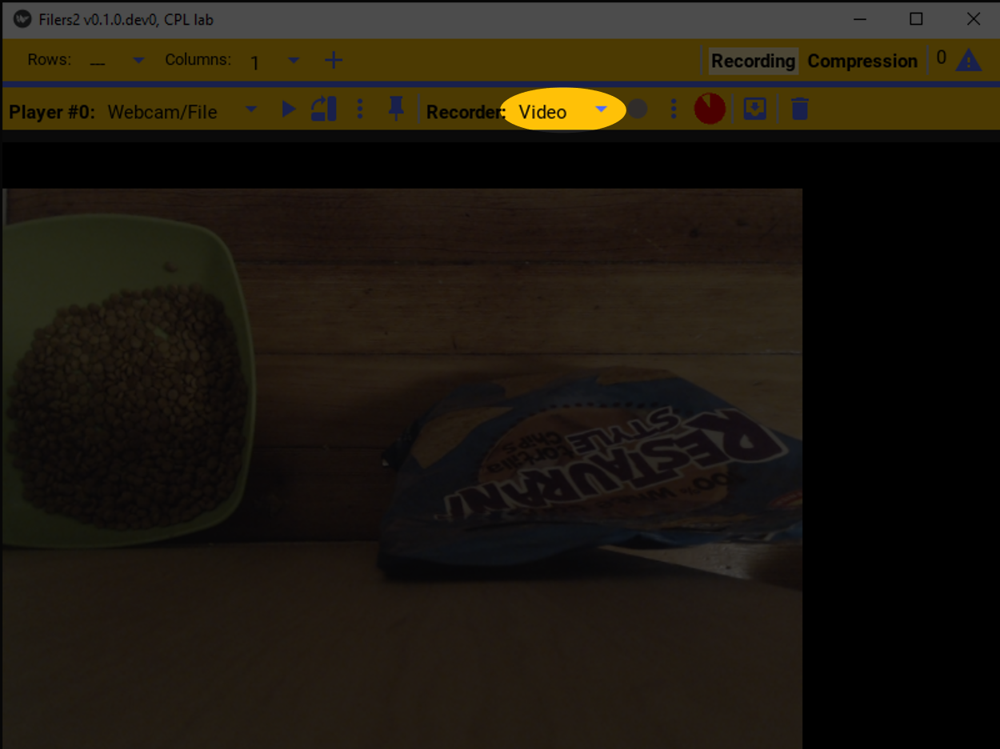
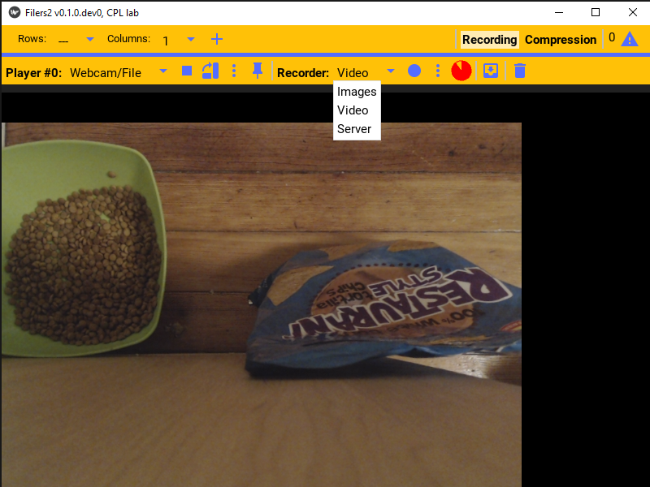
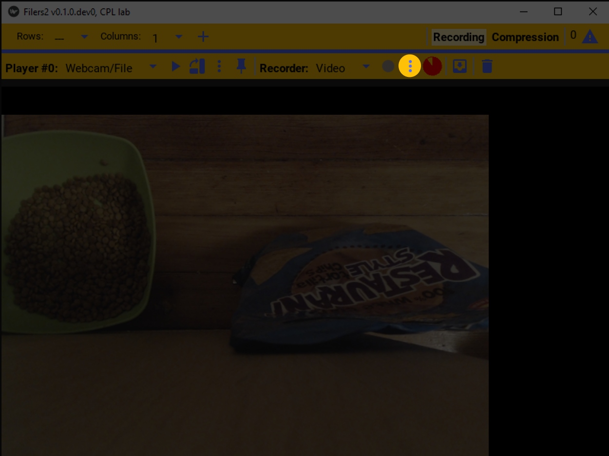
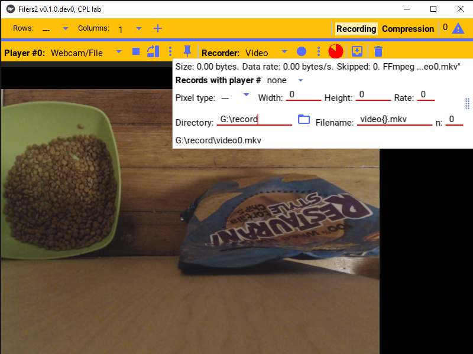
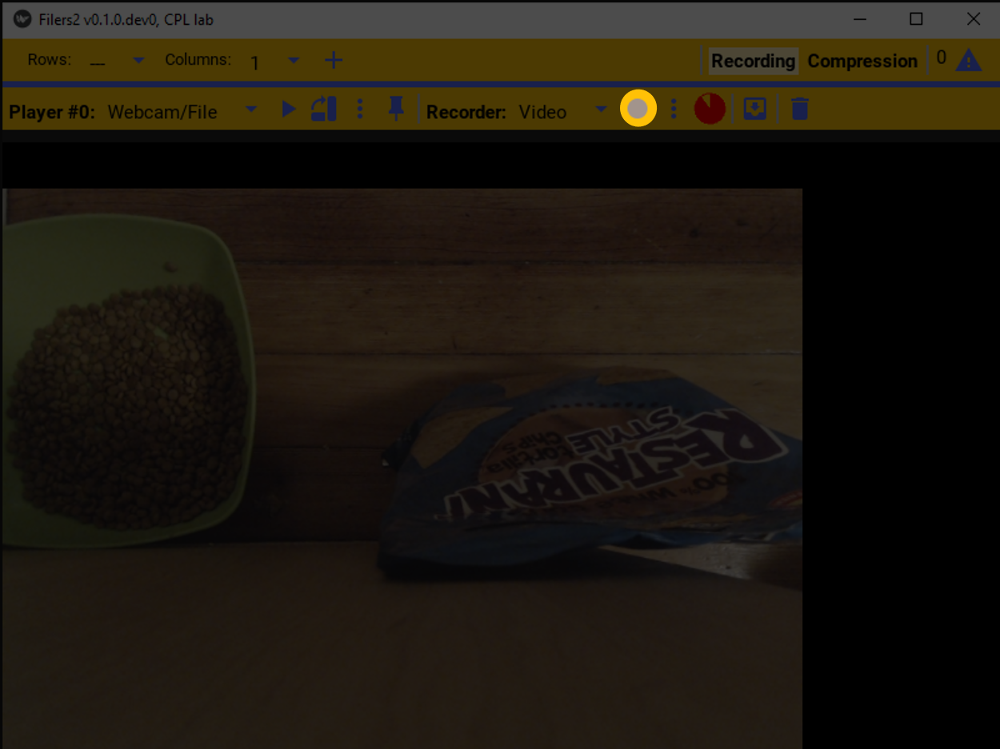
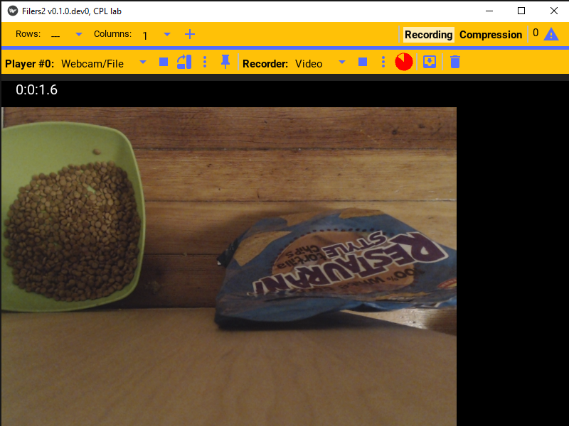
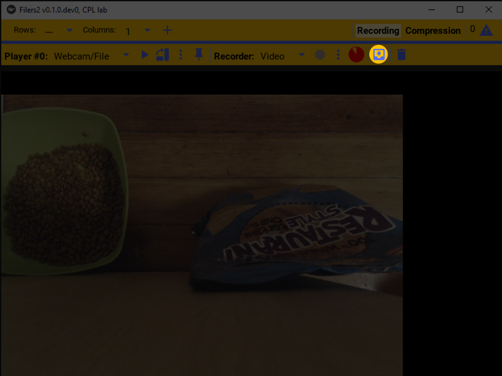
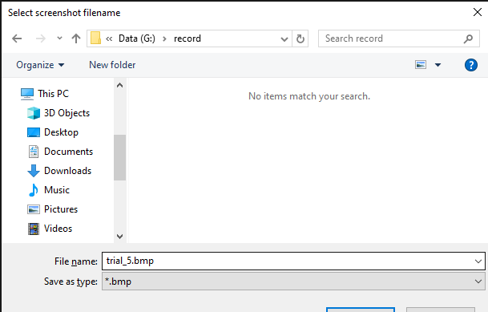
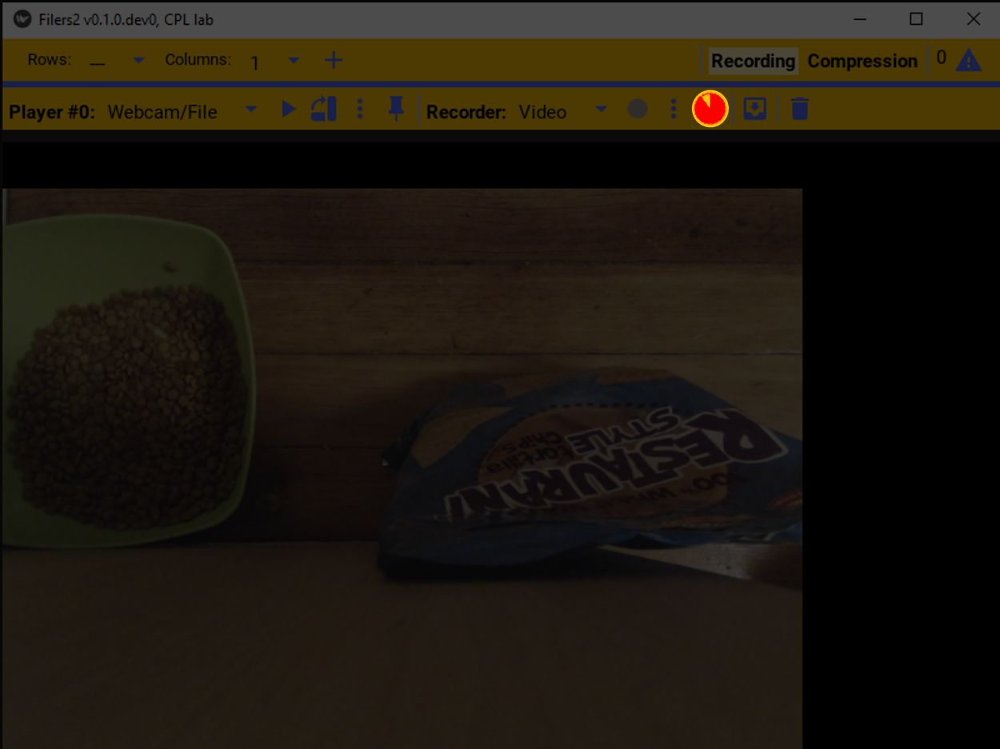

Recorder
--------

Recorder configuration
**********************

.. image:: ../images/guide/recorder_blank.png

Similar to the player, one must first select the type of recorder that will be used. In the record bar click the record type dropdown menu.

This will list the available recording options. This example will use a video file!

To configure the selected recorder, click the settings button. That will open the selected recorder’s settings.

This specific recorder saves the video to a video file.

Recorder control
****************

Once configured, to start recording the player's image, just press the record button.
The record button will be grayed out when the camera is not playing.

Once the camera is playing and the video is being recorded, a timer counting up will display showing the elapsed recording duration.

To stop recording, press the record button again and it'll stop recording. If the player stops playing, the recorder will also stop.

At the top of the recorder setting, it indicates the total size of the current or last recorded files as well as the data rate.

To save a screenshot of the last image displayed, press the save button.

This will pop open a file browser with the image name pre-filled to the video name.

The pie icon indicates how full the disk is on the drive where the video is being saved.

Synchronously recording from multiple cameras
*********************************************

To synchronously start recording from multiple players at once, you need to create a daisy chain of recorders.

Specifically, in the recorder options you can specify if the recorder should start recording when a specific other player starts recording by seting the ``Records with player #`` dropdown to the appropriate option.

So, if there are three players A, B, and C and it is desired that all three should start and stop recording at the same time. Then set recorder B to record with player A and recorder C to record with player B. Then, when you start and stop recording player A, the other two players will also simultaneously start and stop recording.

